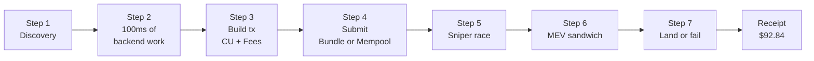
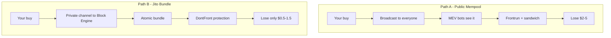
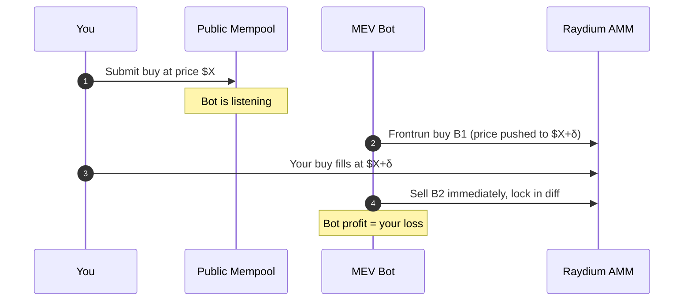
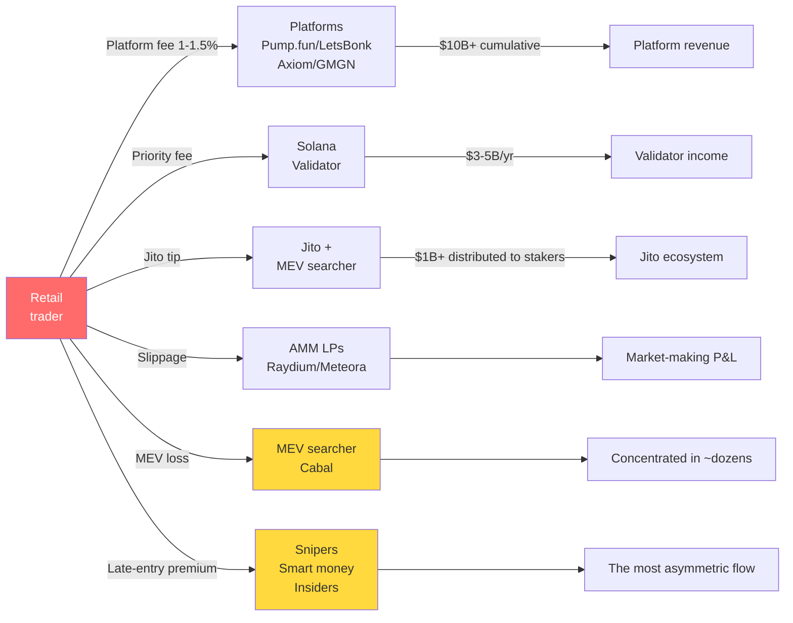
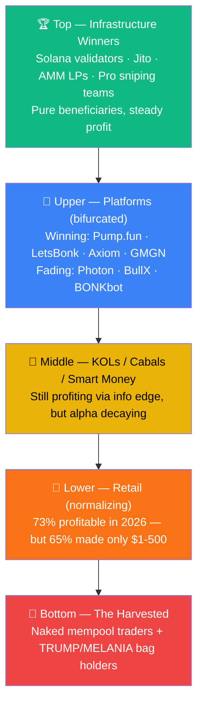

# Your $100 Meme Buy Costs $107. Here's Where the $7 Goes.

*By Frank · May 2026 · ~7500 words · [web3-insider](https://github.com/survivorff/web3-insider)*

---

## Opening

You open your favorite Solana trading terminal. You pick a token. You type `100`, you click **Buy**.

Three seconds later, the UI says: **Filled**. Somewhere in the fine print it says: **Trading fee: 1%**.

You assume you paid $101.

You actually paid somewhere around **$107**.

The extra six bucks isn't a lie — the "1%" on the UI isn't lying to you either. It's just that the UI doesn't show the other six wallets the money went to. This piece is about those six wallets.

One trade. Seven steps. Each step costs you a few cents to a few dollars. They stack up to a six-dollar gap between what the UI says and what your account says. By the end of this article you'll know exactly where every penny went — and why calling it a scam misses the point. **This is the microstructure of a meme trade**, and it's what turned meme trading into a ten-billion-dollar industry.

At the end I'll zoom out from one trade to the entire meme market — where money actually flowed between 2024 and 2026, who's making it, who's losing it, and what I'm watching for the next six to twelve months. That's the part that turns "I understand this trade" into "I understand this industry."

This is **Web3 Insider**'s first article. The mission of this repo is simple: take the invisible machinery of on-chain markets and explain it in plain English, with specific numbers and an insider's view. When an article triggers something that deserves ten thousand more words, I point you to [meme-trade-wiki](https://github.com/survivorff/meme-trade-wiki) or [my long-form blog](https://blog.frankfu.cloud). Deep dives live there. The front door is here.

---

## The Trade We're Dissecting

To keep every number concrete, here's the setup:

```
─── Trade Receipt ──────────────────────────
  Time:        2024-12-10 20:14:33 UTC
  User:        A typical Solana meme trader
  Intent:      Buy $100 worth of $FARTCOIN
  Route:       Raydium CLMM (deepest pool)
  Platform:    A mid-tier TG bot platform

  Intended spend                  $100.00
  ─────────────────────────────────────
  [1] Platform fee (1%)           −$1.00
  [2] Solana base fee             −$0.05
  [3] Priority fee                −$0.38
  [4] Jito bundle tip             −$0.52
  [5] Slippage (2%)               −$2.00
  [6] MEV sandwich loss           −$1.21
  [7] Late-entry premium          −$2.00
  ─────────────────────────────────────
  Tokens actually received        $92.84
  Total leakage                   −$7.16  (7.16%)
────────────────────────────────────────────
```

The numbers move with token, time, and congestion, but **the seven-step structure of the receipt is universal**. Every meme buy on every Solana platform goes through these seven steps, whether you see them or not.

**Why $FARTCOIN?** It's a real Pump.fun graduate from late 2024, briefly a top-ten Solana meme, with enough public liquidity data to make the numbers reproducible. Late 2024 is also the moment the microstructure had all its modern parts in place — Jito bundles, DontFront, smart routing. Earlier stories would be incomplete; later stories would be re-hashing the same machinery.

### The 7 steps at a glance

Before we break each step down, here's the full journey:



Each step costs you a few cents to a few dollars. Let's go, starting before you've even clicked.

---

## Step 1 — You "Discovered" $FARTCOIN 30 Seconds Late

Here's the fantasy of how it went:

> Scroll Twitter → see $FARTCOIN → open TG bot → search → buy.

Here's the reality:

> Sniper bots detect the token (≈ 0s) → alpha groups repost (≈ 5s) → KOLs post (≈ 30s) → **you see it (≈ 60s)**.

By the time *you* "discovered" $FARTCOIN, it had been traded a few hundred times on-chain. Your "early entry" was somewhere north of buyer number 800.

### How did the bots know first?

This layer is called **Token Discovery**, and it's the first piece every serious meme trading platform ships:

- **Geyser subscriptions** directly from Solana validators for Raydium/Pump.fun pool-creation events, sub-50ms latency
- **Multi-RPC WebSockets** so the first validator to see a new pool broadcasts to you instantly
- **Pump.fun graduation tracking** — listening for the specific instructions that mark a bonding curve completing and migrating to Raydium
- **Smart wallet tracking** — if a historically profitable wallet starts buying a new token, fire an alert (and optionally auto-copy)

Stacked together, these give pros and their bots a **30–60 second head start** on you.

### Does this cost you directly?

Not directly. But indirectly, it sets the price you end up buying at **higher than what the first few buyers paid** — that's where line `[7] Late-entry premium $2.00` comes from. For a typical meme launch, **arriving 30 seconds late costs you roughly 1–3%**.

**→ Go Deeper: [Token Discovery Engine, full teardown](https://github.com/survivorff/meme-trade-wiki/blob/main/articles/4-2-token-discovery-engine.md)**

---

## Step 2 — The 100 Milliseconds After You Click Buy

You open the TG bot, type `100`, hit Buy. The UI shows a spinner. Feels like nothing is happening.

Here's what the backend actually does in those 100 ms:

### 2.1 Routing: which DEX

$FARTCOIN liquidity on Solana might be spread across:

| DEX | Typical depth | Typical taker fee |
|---|---|---|
| Raydium CLMM | Deep | 0.25% |
| Raydium V4 AMM | Medium | 0.25% |
| Orca Whirlpool | Medium | 0.30% |
| Meteora DLMM | Medium | 0.15–0.25% |
| PumpSwap | Shallow (but Pump.fun-native) | 0.30% |

The routing engine reads depth and price across pools in real time, then picks the **lowest-total-cost path**. That path might be a single pool, or a split across several.

Done well, you never notice routing exists. Done badly, this step alone can cost you $1–$2 (routing you into a shallow pool → high slippage). **This is one of the biggest differences between a "good" platform and a "bad" one, and it's completely invisible on the UI.**

### 2.2 Slippage

Your UI probably shows "Auto slippage." The platform has to pick a number that's simultaneously:

- **High enough** that when your transaction lands, the price hasn't moved past your limit and **reverted your transaction** (in which case your fees burn but you got nothing)
- **Low enough** that MEV bots don't have a big margin to sandwich you

This is a trade-off, not a single right answer. Good platforms compute dynamic slippage per token and per moment. Bad platforms hard-code 10% (seems safe, actually leaves huge sandwich surface).

### 2.3 Risk checks (honeypot detection)

Roughly 1% of all Solana tokens are honeypots — you can buy them, you can't sell them. Serious platforms run a simulated sell at this step using cached heuristics and ephemeral simulation. Not foolproof — some honeypots are buy-triggered, so a small test buy succeeds and then the real buy is the one that traps you. But cheap checks knock out 80–90% of scams.

### 2.4 Token safety scoring

LP lock status, dev wallet concentration, recent trade history — most platforms compose these into a 0–100 score. Below a threshold, you get a warning.

### 2.5 Build the transaction

Package the intent into a Solana transaction. That's Step 3's territory.

### Cost attribution

This step doesn't charge you directly, but the quality of it determines how bad your slippage is going to be. A great routing engine can cut ~1% off your total bill.

**→ Go Deeper: [Trading Engine architecture](https://github.com/survivorff/meme-trade-wiki/blob/main/articles/4-4-trading-engine.md)**

---

## Step 3 — Building the Transaction: Three Numbers You Have to Pick

To turn your intent into a valid Solana transaction, the platform has to decide three numbers:

```
CU (Compute Unit)              ─── code complexity budget
├── CU price (Priority fee)    ─── lamports you pay per CU
└── Jito Tip                   ─── lamports you pay for bundle ordering
```

**These are not the same thing**, and people who don't know the difference quietly pay 30–50% more than they need to.

### 3.1 Compute Unit: your transaction's compute budget

Solana measures transaction compute in **Compute Units** (CU). For a typical meme buy:

- Simple Raydium swap: ~100K CU
- With DontFront + multi-hop routing: ~200K–400K CU
- Max per transaction: 1.4M CU

**You need to reserve enough CU** or your transaction will hit the limit and fail. **Too much and you waste money.** Good platforms compute this from historical simulations plus the current token's instruction set.

### 3.2 Priority fee: lamports per CU

In 2022 Solana introduced a priority fee market. Your fee per CU determines where your transaction lands in a validator's priority queue:

```
Total priority fee = CU count × CU price
```

**2026 typical priority fees for meme buys**:
- Normal hours: ~0.001–0.005 SOL ($0.2–$1)
- Meme launch peak: ~0.01–0.1 SOL ($2–$20) — the sensation people call "Solana is congested"

Our trade's `$0.38` is the median for a normal evening.

### 3.3 Jito tip: priority *inside* a bundle

**This is the critical distinction most traders miss. Priority fee and Jito tip are not the same thing.**

- **Priority fee** → paid to validators, determines your transaction's order *within a block*
- **Jito tip** → paid to Jito validators, determines your transaction's order *within a Jito bundle*

Jito is a special third-party infrastructure layer on Solana (more in Step 4): 95%+ of validators run its client, and it provides bundle submission — packing multiple transactions atomically. Inside a bundle, higher tip = earlier execution.

**2026 typical Jito tips for meme trades**: $0.1–$2 (peaks above $5 during A-tier launches).

Our `$0.52` is a $FARTCOIN-era median after its graduation hype settled.

### 3.4 The real breakdown

```
[2] Solana base fee:     $0.05
[3] Priority fee:        $0.38
[4] Jito bundle tip:     $0.52
─────────────────────────────
On-chain execution cost: $0.95
```

**Nearly 1% in invisible cost just for the privilege of getting your transaction on-chain.** Not something the UI breaks down for you.

**→ Go Deeper: [Solana transaction mechanics (CU, priority fee, versioned tx)](https://github.com/survivorff/meme-trade-wiki/blob/main/articles/5-1-solana-tx-mechanics.md) · [Jito and MEV, full explainer](https://github.com/survivorff/meme-trade-wiki/blob/main/articles/5-3-jito-and-mev.md)**

---

## Step 4 — Submission: Public Mempool or Jito Bundle?

Transaction built. Now it has to get to the network. There are two paths.

### Path A: Public mempool (legacy Solana path)

Your transaction broadcasts to every validator and RPC. Everyone sees it, including MEV bots.

- **Pro**: cheap — no Jito tip.
- **Con**: **visibility is vulnerability**. Bots see your buy coming, **frontrun** you (buy before you), then **backrun** you (sell after), pocketing your slippage. This is the classic **sandwich attack** (covered in Step 6).

### Path B: Jito Bundle (the 2026 default)

Your transaction goes through a private channel directly to Jito's Block Engine. The Block Engine packages it with other transactions into an atomic bundle and hands it to a validator.

- **Pro 1**: private. Until landed, **no one sees your transaction**.
- **Pro 2**: atomic. Within a bundle, all transactions succeed or all fail.
- **Pro 3**: **DontFront protection** (shipped in 2025). Jito enforces no-frontrun within a bundle, killing most common sandwiches.
- **Con**: you pay a Jito tip (our $0.52).

### The two paths compared



**2026 reality**:

- **95%+ of serious meme buys** (outside beginner-tier platforms) go through Jito Bundles
- The remaining 5% are either new users or people saving pennies

Our trade goes Path B.

### Common misconception

"Jito Bundle means 100% safe." **No.**

Jito is one layer of hardening. It defeats *standard* MEV, but:

- **Cross-bundle competition** still exists. My bundle and your bundle both reach the validator at the same time — whichever executes first gets the better price. That competition doesn't go away.
- **Sophisticated searchers** replicate your intent across rigged paths and extract value differently.
- **Bundle landing rate** isn't 100%. A failed bundle still burns your tip.

**→ Go Deeper: [Jito / MEV / Bundle / DontFront, complete mechanism](https://github.com/survivorff/meme-trade-wiki/blob/main/articles/5-3-jito-and-mev.md)**

---

## Step 5 — The Sniper Race: You Are Not Alone

You think you're a single person making a single trade.

**You are actually one of a few hundred actors trying to buy the same token at the same millisecond.**

### 5.1 Who they are

Three flavors of competitor:

1. **Professional market-making / MEV teams** — tens to hundreds of machines, co-located next to Jito's block engine. Sub-millisecond latency advantages.
2. **Copytrade bots** — watching smart wallets; the moment a tracked wallet buys, they auto-buy at high priority.
3. **KOL / community bots** — watching specific Discord / Telegram channels; the moment a trigger phrase appears, they fire.

### 5.2 The latency gap

| Actor | Time from intent to validator |
|---|---|
| You (web TG bot, residential network) | 300–800ms |
| Paid RPC, standard tier | 150–300ms |
| Professional staked RPC | 50–150ms |
| Jito co-located searcher | **10–50ms** |

You're roughly **an order of magnitude slower** than the top tier. That gap is permanent at your tier — physics, not skill.

### 5.3 Does this charge you directly?

No. **But their buys happen before yours, which pushes the price up by 0.5–2%**, and you pay that higher price. That's the `[7] Late-entry premium $2.00` line. The platform didn't charge you $2. The market structure did.

### 5.4 Is this unfair?

Yes and no.

Yes: in the same system, people with more money and more tech have structural edges. That's by definition.

No: open markets have always worked this way. Wall Street hedge funds co-locate to the NYSE data center. Same phenomenon, now openly visible on-chain.

**Accepting "the market works this way"** makes you calmer. You know what layer of the food chain you're on, and you can adapt instead of feeling cheated every time.

**→ Go Deeper: [The art and cost of sniping](https://github.com/survivorff/meme-trade-wiki/blob/main/articles/3-4-sniping.md)**

---

## Step 6 — MEV: The Sandwich

Steps 5 and 6 sound similar but are different:

- **Step 5 (sniping)**: someone races you to buy → price goes up → you pay more.
- **Step 6 (MEV)**: someone sandwiches your buy → directly extracts your slippage.

### 6.1 How a sandwich fires



```
Timeline:  |B1(bot buys)|Y(you buy)|B2(bot sells)|
            You're in the middle → your price = bot's pushed-up price
```

The execution price you see is the price *after* the bot drove it up. The bot's profit is your loss.

This is a **sandwich attack** (or in MEV jargon, "in-frontrun + out-backrun").

### 6.2 How much does it cost

For a $100 buy:

- **Path A (public mempool)**: expected loss **$2–$5** (with 2% typical slippage, MEV captures about half)
- **Path B (Jito Bundle + DontFront)**: expected loss **$0.50–$1.50** (DontFront blocks standard sandwiches, but some sophisticated variants leak through)
- **Our trade: $1.21** — the median for Path B

### 6.3 Why DontFront doesn't fully kill MEV

DontFront is a Jito-side rule enforced inside a bundle: no in-frontrun + out-backrun patterns. But:

- **Cross-bundle competition** still happens. Two bundles land the same block; whichever executes first captures the cheaper price. That's not a frontrun but has a similar effect.
- **Long-tail statistical MEV**: searchers model your likely intent from wallet history and extract value through lookalike paths. Harder to flag as "frontrunning" but the economics land the same way.

### 6.4 Why DontFront still matters

A lot. Before DontFront shipped in Q1 2025, average MEV loss on meme trades was 3–5%. After shipping, it dropped to 0.5–1.5%.

That single mechanism **saves users billions of dollars a year** on Solana alone. This is what "infrastructure as a public good" actually looks like — a boring protocol feature that moves billions quietly.

**→ Go Deeper: [Sandwich attack, the full explainer](https://github.com/survivorff/meme-trade-wiki/blob/main/articles/3-6-sandwich-attack.md)**

---

## Step 7 — Landing or Failing

Your bundle is with Jito. Jito packages it with other bundles and hands the package to the next validator.

You assume your trade is done. **Until it lands, it isn't.**

### 7.1 What landing rate is

Landing rate = percentage of your submitted transactions that actually make it onto the chain.

**2026 typical Jito bundle landing rates**:

| Scenario | Landing rate |
|---|---|
| Normal hours, typical meme | **85–95%** |
| Moderate congestion | 70–85% |
| Token launch peak | 40–70% |
| Extreme congestion (e.g. TRUMP token launch moment) | **< 20%** |

Most of the time your trade lands. Sometimes — especially at the hottest moments — it doesn't.

### 7.2 What failure costs

When a transaction fails:

- **Priority fee**: **burned.** The validator already did the work; it doesn't refund.
- **Jito tip**: **partially burned** depending on the exact failure mode.
- **Your intent**: unfulfilled. Token not bought.
- **UX**: "Transaction failed." Maximally frustrating.

Platforms usually auto-retry 1–3 times. Meaning:

- One failure × three retries = **4× priority fee**
- Fourth attempt succeeds → you see "filled" but you've paid $1.50 instead of $0.38
- UI may or may not tell you it retried. Good platforms show a retry count. Bad platforms silently bury it.

### 7.3 Why landing rate matters so much

During peak meme trading, **30 seconds is often 10% price movement**. Failing, retrying, failing, retrying means by the time you land, the token has moved — and you've bought less of it with the same money.

**This is where a chunk of `[7] Late-entry premium` comes from** — not just "you were late," but "you retried three times while the price moved away."

### 7.4 Real example: a November 2025 A-tier launch

Afternoon of an A-tier meme launch, November 2025. Solana was on fire:

- Typical bundle landing rate dropped to **42%**
- Average user had to retry **2.4 times** to get a successful fill
- Total priority fee spending ran **6–8× normal**

Experienced traders paused. They know what the network looks like when a whale is moving. Newcomers kept hitting Buy, sending their fee retries to validators.

**→ Go Deeper: [Landing rate truths and optimization](https://github.com/survivorff/meme-trade-wiki/blob/main/articles/5-5-tx-landing-rate.md)**

---

## Step 8 — Back to the Receipt

One more look at the receipt, now every line has a meaning:

```
Intended spend                  $100.00
─────────────────────────────────────
[1] Platform fee (1%)           −$1.00   → platform (UI, ops, risk, support)
[2] Solana base fee             −$0.05   → Solana validator (base fee)
[3] Priority fee                −$0.38   → Solana validator (congestion premium)
[4] Jito bundle tip             −$0.52   → Jito validator (bundle ordering)
[5] Slippage (2%)               −$2.00   → AMM LPs (that's their income)
[6] MEV sandwich loss           −$1.21   → MEV searcher / some returned to validator
[7] Late-entry premium          −$2.00   → earlier buyers / snipers / smart money
─────────────────────────────────────
Tokens actually received        $92.84
Total leakage                   −$7.16  (7.16%)
```

### Is 7% a scam?

**No**, actually. Cleanly:

- **$1.00 platform fee**: legitimate revenue. Platform earned it running the system.
- **$0.95 on-chain execution**: Solana validators + Jito, the people keeping the lights on. Legitimate cost.
- **$2.00 slippage**: payment to LPs for providing liquidity. Legitimate service fee.
- **$1.21 MEV loss**: byproduct of microstructure competition. **Half-legitimate** — it's a real cost today, but better mechanisms could reduce it further.
- **$2.00 late-entry premium**: market efficiency. You arrived late. Others arrived early. Legitimate in the "markets are markets" sense.

**Of the $7, roughly $5 is economically legitimate infrastructure cost.** The other $2 is MEV and timing, and **a well-equipped trader can cut this roughly in half.**

---

## Step 9 — A Platform Operator's View: Why We Built It This Way

I've spent two-plus years building meme trading infrastructure. Every step above was an argument someone had to win.

### Why does the UI show "1%" and not "7%"?

Not because we're trying to scam you. Because:

1. **The 1% is the real platform revenue.** The other six pieces of money, the platform never touched.
2. **The other six numbers are hugely dynamic.** The same $100 trade at a different moment has a Jito tip between $0.50 and $5.
3. **If we showed all seven numbers on the UI, most users would freeze.** Conversion rates collapse. Not user-hostile, just product-dead.
4. **Competitors don't show them either.** The first platform to get ultra-transparent loses to competitors perceived as "cheaper."

This is an **information-asymmetric equilibrium**. The only way to break it is education — which is exactly what this article is doing.

### Why do we accept this microstructure?

Because it's **necessary for the system to function at all**:

- **No priority fee** → everyone has equal queue priority, network melts during congestion
- **No Jito tip** → no infrastructure upgrades, ecosystem stagnates
- **No slippage** → LPs don't provide liquidity, markets dry up
- **No MEV searchers** → no arbitrage, price discovery breaks

Every "extra dollar" you pay is keeping some piece of the system alive that you rely on. **The 7% is the operating cost of meme trading existing as a $10B industry.**

### How to drive your 7% down to 3%

If you want to minimize your trading cost:

1. **Route through Jito Bundles** (saves $1–$2 in MEV)
2. **Use precise, dynamic slippage** (saves $0.50)
3. **Avoid the first 10 minutes of any token launch** (saves $1–$2 in late-entry premium)
4. **Use a good platform** — good routing + smart retry + high landing rate
5. **Split large orders** — often cheaper to split a $300 trade into three $100s than to execute a single $300

**The floor**: about $3–$4 total cost on a $100 trade (3–4%). Below that is physically impossible — it's what running the on-chain microstructure costs.

---

## Step 10 — The Market Pulse: What's Actually Happening, 2024–2026

Everything above was the microstructure of **one** trade. This section zooms out to the **tens of billions of dollars** flowing through the meme market.

This is the most important section of the article. Because **if you don't know where the money is, who's making it, and where the tide is turning, all the microstructure optimization in the world is just rearranging deck chairs.**

### 10.1 Three waves — rise, collapse, rebirth

**2024 Q2–Q4 — Pump.fun's genesis**

- Pump.fun launched January 2024. Daily token creation peaked at **~70,000 tokens** in November 2024.
- 90% of new Solana tokens launched through it.
- Cumulative protocol revenue approaching $800M.
- Hall-of-fame graduates: $FARTCOIN, $MOODENG, $PNUT, $CHILLGUY.

November 2024 was the final chapter of "everyone gets rich quick."

**2025 Q1–Q3 — winter and collapse of trust**

Two events broke the market simultaneously:

1. **TRUMP + MELANIA event, January 2025:**
   - TRUMP coin crashed **93%** from peak.
   - MELANIA coin crashed **99%** from peak.
   - Net outcome: for every dollar insiders earned, retail lost $20. Cumulative retail loss **~$4.3B**.
   - This one event permanently changed retail psychology: "meme is organized extraction."

2. **Profitability collapsed to historic lows:**
   - June 2025: only **30.08%** of active Pump.fun wallets were profitable.
   - The other 70% lost, and most of them lost 90%+.

3. **LetsBonk's counter-attack:**
   - Q3 2025 — LetsBonk.fun briefly captured **64%** of Solana launchpad share. Pump.fun collapsed to 22%.
   - Core differentiator: BONK's revenue-to-buyback flywheel and lower fees.
   - November–December 2025 — Pump.fun counter-attacks with the PUMP token ICO: **$600M raised in 12 minutes** + $720M in private sale = **$1.3B cash treasury**, enabling aggressive buybacks.

**2026 Q1–Q2 — V-shaped reversal and professionalization**

This is **now**. The data shows a remarkably fast structural reversal:

```
Pump.fun profitable wallet share
─────────────────────────────
2025-06:  30.08%  ← bottom
2025-12:  ~45%
2026-01:  50.1%
2026-02:  56.8%
2026-03:  70.0%
2026-04:  73.28%  ← two-year high
```

**Four consecutive months of monotonic increase.** Not a bounce — a structural shift.

Three causes converged:

1. **Infrastructure matured.** Jito Bundle + DontFront + better RPCs went mainstream, cutting MEV loss from 5% to 1.5%.
2. **Information asymmetry narrowed.** Smart wallet tracking, token safety scores, anti-sniper launchpad mechanics raised the floor on rug-pulls and manipulation.
3. **The player pool self-filtered.** The 2025 winter wiped out most "just-clicking-Buy" traders. The ones still standing are more skilled.

**But don't misread this.** Of the 73% profitable wallets in April 2026, **65% earned between $1–$500**. Only **5.4% earned more than $1000**. This isn't "everyone's getting rich." It's **"fewer people are getting wiped out."**

### 10.2 The money flow: who's paying whom

If you draw the meme trading ecosystem's money flow:



Across 2024–2026, **the biggest wealth transfer wasn't retail-to-retail. It was retail-to-infrastructure.** Validators, MEV searchers, and the professional sniping layer are the three groups making sustainable profit.

### 10.3 The food chain: who's winning, who's losing

Layered by 2026 Q1–Q2 data:



**Top tier — infrastructure winners (pure beneficiaries):**
- **Solana validators**: capture a piece of every transaction fee, ~$4B annualized, 95%+ run Jito's client
- **Jito Labs and MEV searchers**: process every Jito bundle, expanding further via BAM
- **Deep AMM LPs**: Raydium and Meteora collectively printing from 2024–2026
- **Mature sniping teams**: ~10–20 shops co-located at Jito's block engine, running professional market-making + MEV

**Upper tier — platform winners (bifurcated, not everyone wins):**
- **Pump.fun**: $1.09B cumulative revenue. April 2026 shifted to 50% of revenue going to PUMP buybacks, giving the token real support.
- **LetsBonk**: Peaked at 64% launchpad share in Q3 2025, still holding 50%+ in 2026 Q2, BONK token flywheel turning.
- **Axiom**: 2026 annualized revenue ~$79M, leading on-chain trading terminal. **In February 2026, blockchain investigator ZachXBT alleged that a senior Axiom employee used internal tools to access user data and front-run memecoins. Axiom responded by removing those system accesses — the first public case of a platform trust crisis in this category.**
- **GMGN**: 5× revenue growth Q1 2026, mostly on BSC via Four.meme ecosystem.
- **Decliners**: Photon, BullX, BONKbot — down significantly from 2025 peaks, losing competitive position.

**Middle tier — KOLs / cabals / smart money:**
- Holders of information and timing advantages, exploiting Discord / Telegram leakage to frontrun official launches
- The segment that made the biggest relative profits in 2024–2025
- Increasingly challenged in 2026 by smart wallet tracking and AML flagging
- Still profitable, but **alpha is decaying fast**

**Lower tier — retail (normalizing):**
- Lost most of 2025. Broke even or made small profits in 2026.
- But the ceiling is low: 65% of profitable 2026 wallets earned $1–$500.
- The "buy new launch and moon" strategy is largely dead — anti-sniper mechanics and reputation-gated launchpads have closed the extremes.

**Bottom tier — the harvested:**
- "Follow KOL + manual buy + naked mempool" traders still get extracted from.
- Insider-distribution schemes like TRUMP / MELANIA, each reload recruits a new cohort to harvest.

### 10.4 The execution-layer migration: TG bot → on-chain terminal

The biggest 2025–2026 structural shift most coverage misses.

**2024**: Telegram bots (BONKbot, Trojan, Maestro) were the default execution entry for on-chain trading. Conversational interface, low barrier to entry, limited functionality.

**2026**: Web-based on-chain trading terminals (Axiom, Photon, GMGN, BullX, Banana Pro) have replaced TG bots as the primary execution layer for active traders.

Drivers of the migration:

- **UI complexity**: modern meme trading requires charting, position tracking, smart wallet feeds, MEV protection toggles, multi-route configuration. Conversational UI can't handle it.
- **Speed**: web infrastructure (WebSocket feeds, dedicated RPC pools) is an order of magnitude lower-latency than TG bots.
- **Concurrency**: serious traders run monitoring + trading across 5–10 tokens simultaneously. Conversational interfaces can't multiplex.

**What this migration signifies**: the meme trader population is professionalizing. The "casual TG bot plays" era is over. You're now either using professional tools, or you're the counterparty to people who are.

### 10.5 What I'm watching — trends for the next 6–12 months

From the perspective of someone building this infrastructure, here's what I'm tracking for Q3 2026 through Q1 2027:

**1. The market hits a plateau; professional consolidation deepens.**

The 2024 TGE-everywhere explosion is gone, and it isn't coming back. That's fine. The people left are more serious. Platform competition shifts from "who has the best UX" to "who gives professional traders the most alpha."

**2. AI agents will reshape the trader population.**

In the Hyperliquid piece I'll publish next, I argue that AI agents have an overwhelming native edge for on-chain trading — they optimize priority fee, slippage, routing, and timing all at once in milliseconds.

**My prediction**: by 2027, **10–20% of meme trading volume will come from AI agents.** This doesn't eliminate retail, but it puts "retail on manual TG bot" at the absolute bottom of the food chain. Unless you adopt agent tools too.

**3. Platform trust crises will recur.**

The Axiom incident wasn't the last. When your platform holds every user's trading history and wallet relationships, insider compliance is hard. **My call**: the next 12 months see at least 1–2 similar events. The first platform to build "internal permissioning + external audit + reimbursement policy" becomes the long-term winner.

**4. Pump.fun's buyback model is a template.**

The April 2026 shift to 50% revenue → token buybacks is a template for all of consumer crypto. If this model proves sustainable, it means **on-chain UGC products can run on real revenue instead of token inflation.** That's a major business model unlock, and not just for meme platforms.

**5. Chain fragmentation, not consolidation.**

In 2024 Solana owned 90%+ of the meme market. In 2026, BSC (Four.meme), Base (Zora, Clanker), Ethereum mainnet (PEPE and the long tail), Tron, and Hyperliquid spot are all drawing meme volume.

Different chains develop different meme cultures: Solana stays highest-activity-shortest-lifecycle, Base leans social + creator-economy, BSC is more Asian and lower-cost. **A trading platform that natively spans multiple chains is probably the next major goldmine.**

**6. Regulation is coming.**

The TRUMP / MELANIA fallout has the SEC paying attention. Late 2026 through mid-2027 is the window for the first real regulatory action. Exactly what it looks like is uncertain, but **fully-unregulated meme trading is probably not the long-run default.** KYC + whitelists + licensed operations may become a required path for the largest platforms.

---

## What This All Means

### 11.1 This isn't an attack on meme trading

I didn't write this to talk you out of trading memes. I wrote it to give you **perspective**.

The 6% gap between the UI's "1%" and your real bill is the cost of a ten-billion-dollar industry functioning. **Know it, accept it, and trade smarter than people who don't.**

### 11.2 This is microstructure education

**Microstructure** in traditional finance is a serious discipline with textbooks and PhDs. The on-chain version is 2–3 years old and barely written down. This article is just the overview. Every step can be — and will be — its own deep dive.

### 11.3 Implications for AI agent trading

In 2026, a rapidly growing share of on-chain trading is done by AI agents. **They face exactly the same problems retail does:**

- Routing
- Priority fee and Jito tip pricing
- MEV avoidance
- Landing rate optimization

**The critical difference: agents compute.** They calculate the optimal fee mix in real-time and self-tune continuously. The **cost differential between a human and an agent trader** is, in my view, **one of the biggest alphas in this market going forward.**

Coming up on Web3 Insider — a full piece on this.

---

## Go Deeper

**If you want to go further:**

### Technical depth → meme-trade-wiki

41-article industry handbook. Every section in this piece has a chapter:

- [How a token discovery engine actually works](https://github.com/survivorff/meme-trade-wiki/blob/main/articles/4-2-token-discovery-engine.md)
- [Trading engine architecture](https://github.com/survivorff/meme-trade-wiki/blob/main/articles/4-4-trading-engine.md)
- [Solana transaction mechanics](https://github.com/survivorff/meme-trade-wiki/blob/main/articles/5-1-solana-tx-mechanics.md)
- [Jito and MEV deep dive](https://github.com/survivorff/meme-trade-wiki/blob/main/articles/5-3-jito-and-mev.md)
- [Sniping infrastructure](https://github.com/survivorff/meme-trade-wiki/blob/main/articles/3-4-sniping.md)
- [Sandwich attacks explained in full](https://github.com/survivorff/meme-trade-wiki/blob/main/articles/3-6-sandwich-attack.md)
- [Landing rate engineering](https://github.com/survivorff/meme-trade-wiki/blob/main/articles/5-5-tx-landing-rate.md)
- [How Pump.fun built a $10B market](https://github.com/survivorff/meme-trade-wiki/blob/main/articles/2-1-how-pumpfun-created-a-market.md)

### Long-form and personal take → blog

- 📝 [blog.frankfu.cloud](https://blog.frankfu.cloud) — Chinese deep-dives and inside-the-exchange notes

### Coming up on Web3 Insider

**Episode 02**: *Why Hyperliquid Won Perps: A CEX Engineer's Architectural Breakdown*

From the microstructure of a single meme trade, we zoom out to how an entire L1 was built from scratch for trading.

- ⭐ [Star web3-insider](https://github.com/survivorff/web3-insider)
- 𝕏 [Follow @FrankFu2262](https://x.com/FrankFu2262)

---

*Found a factual error? Open an issue. Disagree with the take? That's more fun on X.*
